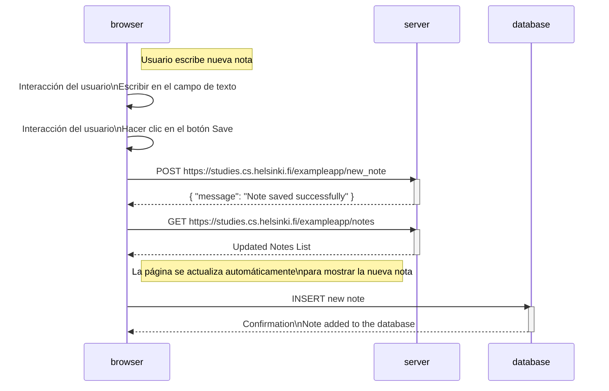

```mermaid
sequenceDiagram
    participant browser
    participant server
    participant database

    Note right of browser: Usuario escribe nueva nota

    browser->>browser: Interacción del usuario\nEscribir en el campo de texto

    browser->>browser: Interacción del usuario\nHacer clic en el botón Save

    browser->>server: POST https://studies.cs.helsinki.fi/exampleapp/new_note
    activate server
    server-->>browser: { "message": "Note saved successfully" }
    deactivate server

    browser->>server: GET https://studies.cs.helsinki.fi/exampleapp/notes
    activate server
    server-->>browser: Updated Notes List
    deactivate server

    Note right of browser: La página se actualiza automáticamente\npara mostrar la nueva nota

    browser->>database: INSERT new note
    activate database
    database-->>browser: Confirmation\nNote added to the database
    deactivate database
``` 
