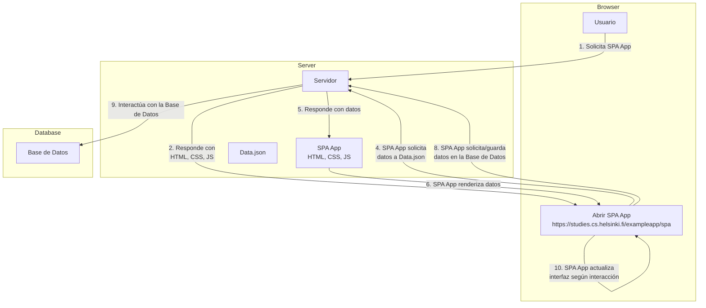

```mermaid 
graph TD
  subgraph Browser
    A[Usuario]
    B[Abrir SPA App<br>https://studies.cs.helsinki.fi/exampleapp/spa]
  end

  subgraph Server
    C[Servidor]
    D[SPA App<br>HTML, CSS, JS]
    E[Data.json]
  end

  subgraph Database
    F[Base de Datos]
  end

  A -->|1. Solicita SPA App| C
  C -->|2. Responde con<br>HTML, CSS, JS| B
  B -->|3. Carga y renderiza<br>la SPA App| B

  B -->|4. SPA App solicita<br>datos a Data.json| C
  C -->|5. Responde con datos| D
  D -->|6. SPA App renderiza datos| B

  B -->|7. Usuario interactúa<br>con la SPA App| B

  B -->|8. SPA App solicita/guarda<br>datos en la Base de Datos| C
  C -->|9. Interactúa con la Base de Datos| F

  B -->|10. SPA App actualiza<br>interfaz según interacción| B
```
